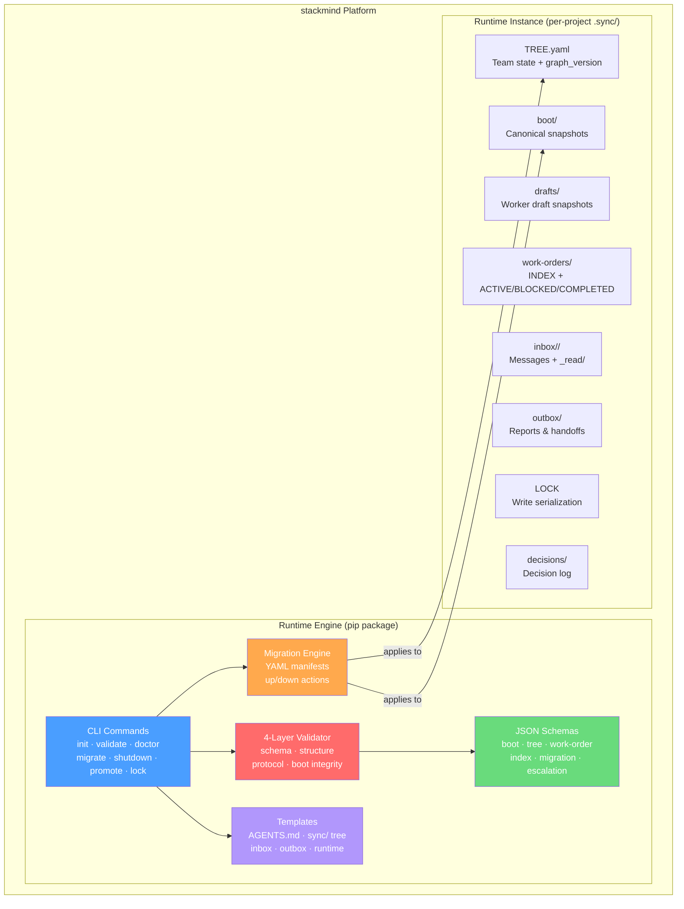
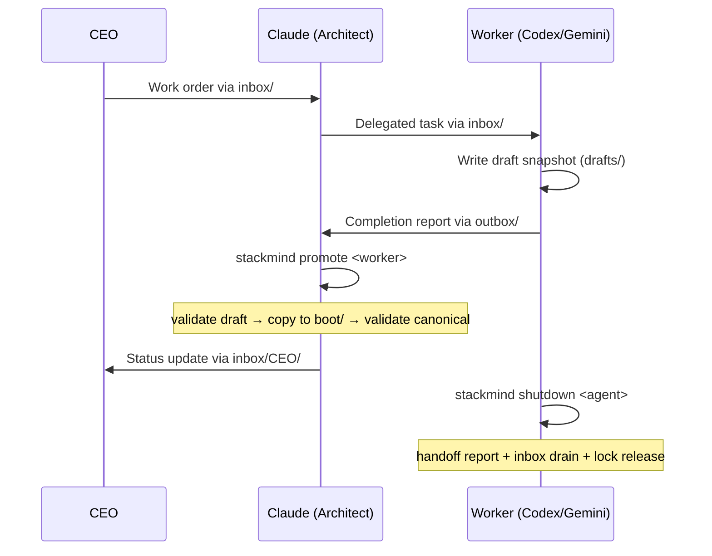
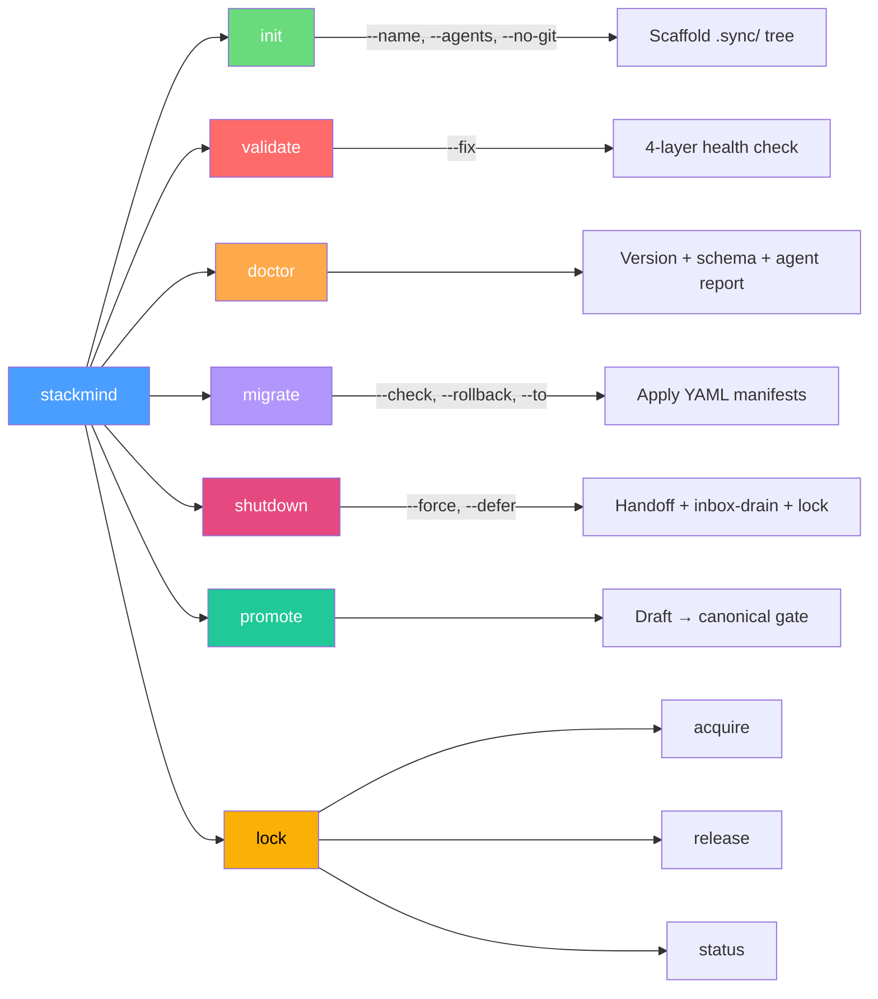
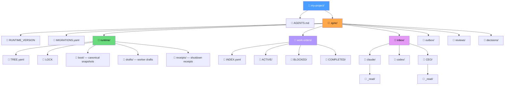

# STACKMIND

> Reusable Multi-Agent Engineering Runtime Platform

**Version:** 1.2.0 · **Python:** ≥3.10 · **License:** MIT · **Author:** Abhishek Sharma

---

## What Is StackMind?

StackMind is a runtime platform that coordinates teams of AI agents (Claude, Codex, Gemini, Gemma, Local-LLM) working on a shared software project. Think of it as an **operating system for multi-agent engineering** — it provides the messaging bus, task management, session continuity, and protocol enforcement that agents need to collaborate without stepping on each other.

### Core Capabilities

| Capability | What It Does |
|---|---|
| **Inbox/Outbox Messaging** | Structured agent-to-agent communication with `_read/` deduplication |
| **Work Order Management** | Task lifecycle (ACTIVE → BLOCKED → COMPLETED) with deliverable tracking |
| **Boot Snapshots** | Session continuity across context-window limits — agents resume where they left off |
| **Schema Validation** | 4-layer runtime integrity checks (schema, structure, protocol, boot) |
| **Migration System** | YAML-manifest driven version upgrades with rollback support |
| **Shutdown Validation** | Enforces handoff reports + drained inboxes before session ends |
| **Write Lock** | Serializes canonical writes so agents don't clobber shared state |
| **Promotion Gate** | Validate-before-and-after gate for worker draft → canonical snapshot promotion |

### Authority Model

```
CEO (Top Manager)
  └─ Claude (Senior Architect)
       └─ Gemma (QA Lead)
            └─ Workers: Codex, Gemini, Local-LLM
```

Claude owns canonical state. Workers write drafts that get promoted through a validation gate. CEO oversees via inbox.

---

## Architecture Overview



---

## Data Flow



---

## CLI Command Map



---

## File Structure

```mermaid
graph TD
    ROOT["📁 stackmind/"] --> CLI_DIR["📁 cli/<br/><i>CLI commands & entrypoint</i>"]
    ROOT --> SCHEMAS_DIR["📁 schemas/<br/><i>JSON Schema definitions</i>"]
    ROOT --> VALIDATORS_DIR["📁 validators/<br/><i>Validation logic</i>"]
    ROOT --> MIGRATIONS_DIR["📁 migrations/<br/><i>Version upgrade manifests</i>"]
    ROOT --> TEMPLATES_DIR["📁 templates/<br/><i>Project scaffolding templates</i>"]
    ROOT --> TESTS_DIR["📁 tests/<br/><i>pytest suite</i>"]
    ROOT --> DOCS_DIR["📁 docs/<br/><i>Documentation</i>"]
    ROOT --> EXAMPLES_DIR["📁 examples/<br/><i>Example projects</i>"]
    ROOT --> INCIDENT_DIR["📁 incident/<br/><i>Post-mortem reports</i>"]
    ROOT --> CONFIG["📄 pyproject.toml"]

    CLI_DIR --> CLI_MAIN["main.py — Click entrypoint"]
    CLI_DIR --> CLI_INIT["init.py — Project scaffolding"]
    CLI_DIR --> CLI_VAL["validate.py — 4-layer validator"]
    CLI_DIR --> CLI_MIG["migrate.py — Migration engine"]
    CLI_DIR --> CLI_SHUT["shutdown.py — Agent shutdown"]
    CLI_DIR --> CLI_PROM["promote.py — Draft promotion"]
    CLI_DIR --> CLI_LOCK["lock.py — Write lock mgmt"]
    CLI_DIR --> CLI_DOC["doctor.py — Health report"]
    CLI_DIR --> CLI_DEC["decisions.py — Decision logging"]

    SCHEMAS_DIR --> S1["boot.schema.json"]
    SCHEMAS_DIR --> S2["tree.schema.json"]
    SCHEMAS_DIR --> S3["work-order.schema.json"]
    SCHEMAS_DIR --> S4["index.schema.json"]
    SCHEMAS_DIR --> S5["migration.schema.json"]
    SCHEMAS_DIR --> S6["runtime-version.schema.json"]
    SCHEMAS_DIR --> S7["escalation.schema.json"]

    MIGRATIONS_DIR --> MIG1["v1_0_0_to_v1_1_0.yaml"]
    MIGRATIONS_DIR --> MIG2["v1_1_0_to_v1_2_0.yaml"]

    TEMPLATES_DIR --> T1["AGENTS.template.md"]
    TEMPLATES_DIR --> T2["README.template.md"]
    TEMPLATES_DIR --> TSYNC["📁 sync/ — Full .sync/ scaffold"]

    TSYNC --> TS1["runtime/ — boot, drafts, receipts"]
    TSYNC --> TS2["work-orders/ — INDEX + status dirs"]
    TSYNC --> TS3["inbox/ · outbox/ · decisions/"]
    TSYNC --> TS4["reviews/ · releases/ · escalations/"]

    TESTS_DIR --> TT1["test_init.py"]
    TESTS_DIR --> TT2["test_validate.py"]
    TESTS_DIR --> TT3["test_migrate.py"]
    TESTS_DIR --> TT4["test_shutdown.py"]
    TESTS_DIR --> TT5["test_promote.py"]
    TESTS_DIR --> TT6["test_lock.py"]
    TESTS_DIR --> TT7["test_doctor.py"]
    TESTS_DIR --> TT8["test_decisions.py"]
    TESTS_DIR --> TT9["test_cli_integration.py"]

    DOCS_DIR --> DD1["getting-started.md"]
    DOCS_DIR --> DD2["architecture.md"]
    DOCS_DIR --> DD3["protocols.md"]
    DOCS_DIR --> DD4["cli-reference.md"]
    DOCS_DIR --> DD5["migration-guide.md"]
    DOCS_DIR --> DD6["📁 rfcs/ — RFC-001"]

    style ROOT fill:#4a9eff,color:#fff
    style CLI_DIR fill:#69db7c,color:#000
    style SCHEMAS_DIR fill:#ffa94d,color:#000
    style VALIDATORS_DIR fill:#ff6b6b,color:#fff
    style MIGRATIONS_DIR fill:#b197fc,color:#fff
    style TEMPLATES_DIR fill:#e599f7,color:#000
    style TESTS_DIR fill:#fab005,color:#000
    style DOCS_DIR fill:#20c997,color:#fff
    style EXAMPLES_DIR fill:#868e96,color:#fff
    style INCIDENT_DIR fill:#e64980,color:#fff
```



---

## Generated Runtime Structure (after `stackmind init`)



---

## Validation Layers

| Layer | Checks |
|---|---|
| **1. Schema** | YAML syntax, JSON Schema compliance for boot, tree, work-orders, index |
| **2. Structure** | Required directories exist, required files present |
| **3. Protocol** | Authority model, blocked-agent rules, deliverable requirements, write-lock integrity, review bundling, completion-notice `release_target` |
| **4. Boot Integrity** | Snapshot consistency, version alignment, graph_version checks, canonical drift (TREE vs INDEX), snapshot version lag, `.sync-ref` anchoring |

---

## Tech Stack

| Component | Technology |
|---|---|
| Language | Python ≥3.10 |
| CLI Framework | Click ≥8.0 |
| Schema Validation | jsonschema ≥4.0 |
| Data Format | YAML (PyYAML ≥6.0) |
| Terminal Output | Rich ≥13.0 |
| Build System | Hatchling |
| Testing | pytest + pytest-cov |
| Linting | Ruff |

---

## Quick Start

```bash
pip install stackmind

stackmind init ./my-project --name "My Project"
stackmind validate ./my-project
stackmind doctor ./my-project
stackmind migrate ./my-project
stackmind shutdown claude
```

---

## Key Design Decisions

1. **File-system as database** — All state lives in YAML files under `.sync/`. No external DB needed. Git tracks history.
2. **Inbox deduplication** — `_read/` subdirectories prevent agents from re-processing messages.
3. **Write lock** — Single LOCK file serializes canonical writes across concurrent agent sessions.
4. **Promotion gate** — Workers can't directly modify canonical boot snapshots. Draft → validate → promote → validate.
5. **Migration manifests** — Version upgrades expressed as declarative YAML with `up`/`down` actions. Rollback built in.
6. **`.sync-ref` anchoring** — Main repo tracks last-known-good `.sync` commit SHA for verifiable cross-repo consistency.
