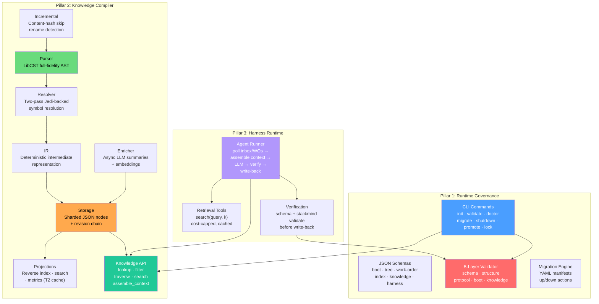
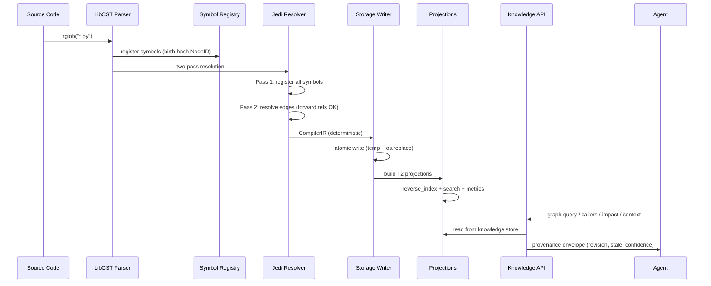
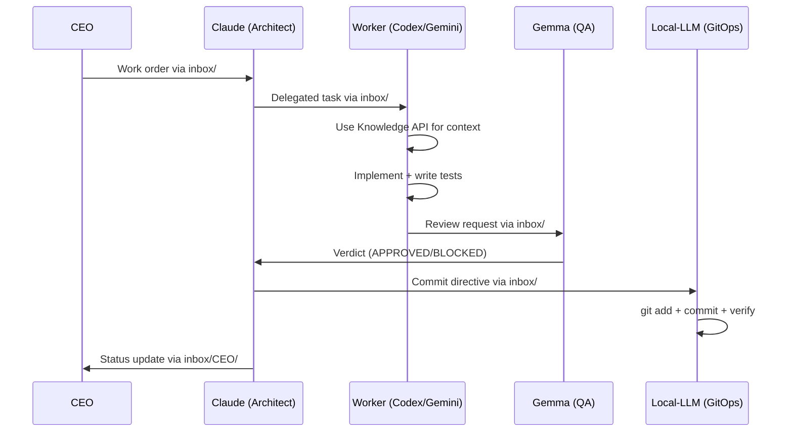
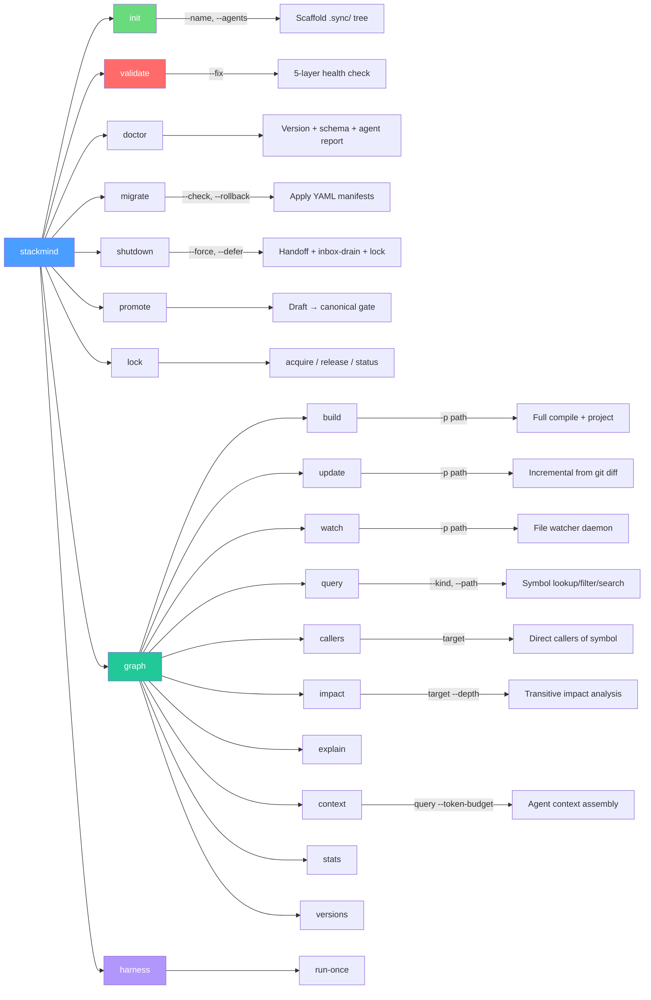

```mermaid
graph TD
    ROOT["📁 stackmind/"] --> CLI_DIR["📁 cli/<br/><i>CLI commands</i>"]
    ROOT --> SCHEMAS_DIR["📁 schemas/<br/><i>JSON Schema definitions</i>"]
    ROOT --> VALIDATORS_DIR["📁 validators/<br/><i>Validation + Knowledge + Harness</i>"]
    ROOT --> MIGRATIONS_DIR["📁 migrations/<br/><i>Version upgrade manifests</i>"]
    ROOT --> TEMPLATES_DIR["📁 templates/<br/><i>Project scaffolding</i>"]
    ROOT --> TESTS_DIR["📁 tests/<br/><i>pytest suite (304 tests)</i>"]
    ROOT --> DOCS_DIR["📁 docs/<br/><i>Architecture + RFCs</i>"]

    CLI_DIR --> CLI_MAIN["main.py — Click entrypoint"]
    CLI_DIR --> CLI_GRAPH["graph.py — Knowledge graph commands"]
    CLI_DIR --> CLI_HARNESS["harness.py — Agent runner"]
    CLI_DIR --> CLI_VAL["validate.py — 5-layer validator"]
    CLI_DIR --> CLI_LOCK["lock.py — Write lock mgmt"]
    CLI_DIR --> CLI_OTHER["init · migrate · shutdown · promote · doctor · decisions"]

    VALIDATORS_DIR --> VK["📁 knowledge/<br/><i>Knowledge Compiler</i>"]
    VALIDATORS_DIR --> VH["📁 harness/<br/><i>Agent Runner</i>"]

    VK --> VK_REG["registry.py — Symbol Registry"]
    VK --> VK_COMP["📁 compiler/<br/>parse · resolve · ir<br/>incremental · rename · watcher"]
    VK --> VK_STORE["storage.py + writer.py"]
    VK --> VK_PROJ["📁 projections/<br/>reverse_index · search · metrics"]
    VK --> VK_API["api.py — Knowledge API"]
    VK --> VK_ENRICH["enricher.py + enricher_queue.py"]
    VK --> VK_VAL["validate.py — Layer-5"]

    VH --> VH_RUN["runner.py — Governed execution loop"]
    VH --> VH_RET["retrieval.py — Search tools"]

    SCHEMAS_DIR --> S_RT["boot · tree · work-order · index"]
    SCHEMAS_DIR --> S_K["📁 knowledge/<br/>symbol · node · revision · ai-block"]
    SCHEMAS_DIR --> S_H["harness-output.schema.json"]

    style ROOT fill:#4a9eff,color:#fff
    style CLI_DIR fill:#69db7c,color:#000
    style VALIDATORS_DIR fill:#ff6b6b,color:#fff
    style VK fill:#20c997,color:#fff
    style VH fill:#b197fc,color:#fff
    style SCHEMAS_DIR fill:#ffa94d,color:#000
```

# STACKMIND

> Compiler-Backed Multi-Agent Engineering Runtime

**Version:** 2.0.0 · **Python:** ≥3.10 · **License:** MIT · **Author:** Abhishek Sharma

---

## What Is StackMind?

StackMind is a runtime platform that coordinates teams of AI agents working on a shared software project. It provides three integrated pillars: **governance** (protocol enforcement), a **knowledge compiler** (deterministic source understanding), and a **harness** (governed agent execution). Together, they form an operating system for multi-agent engineering where agents start from shared compiled understanding instead of independently rediscovering context.

### The Three Pillars

| Pillar | What It Does | Status |
|--------|-------------|--------|
| **1. Runtime Governance** | Messaging, task management, session continuity, protocol enforcement, write locks | Shipped v1.2.0 |
| **2. Knowledge Compiler** | Deterministic source→IR compilation, persistent knowledge store, query API | Shipped v2.0.0 |
| **3. Harness Runtime** | Governed agent execution loop with Knowledge API integration | Shipped v2.0.0 |

### Core Capabilities

| Capability | What It Does |
|---|---|
| **Inbox/Outbox Messaging** | Structured agent-to-agent communication with `_read/` deduplication |
| **Work Order Management** | Task lifecycle (ACTIVE → BLOCKED → COMPLETED) with deliverable tracking |
| **Boot Snapshots** | Session continuity across context-window limits — agents resume where they left off |
| **Schema Validation** | 5-layer runtime integrity checks (schema, structure, protocol, boot, knowledge) |
| **Knowledge Compiler** | Deterministic source-to-IR: parse, resolve, store, project — byte-identical output |
| **Symbol Registry** | Permanent identity (NodeID) that survives renames, moves, and refactoring |
| **Knowledge API** | Four query primitives: lookup, filter, traverse, search + context assembly |
| **Incremental Compilation** | Content-hash dirty detection, affected-set computation, rename/move detection |
| **Background Intelligence** | Async LLM enrichment (summaries, embeddings) without touching deterministic state |
| **Harness Runner** | Governed agent execution: poll → context → LLM → verify → write-back |
| **Write Lock** | Serializes canonical writes so agents don't clobber shared state |
| **Promotion Gate** | Validate-before-and-after gate for worker draft → canonical snapshot promotion |
| **Migration System** | YAML-manifest driven version upgrades with rollback support |

### Authority Model

```
CEO (Top Manager)
  └─ Claude (Senior Architect)
       └─ Gemma (QA Lead)
            └─ Workers: Codex, Gemini, Local-LLM
```

Claude owns canonical state. Workers write drafts that get promoted through a validation gate. CEO oversees via inbox.

---

## Architecture Overview



---

## Knowledge Compiler Pipeline



---

## Data Flow (Agent Coordination)



---

## CLI Command Map



---

## File Structure



---

## Knowledge Store Structure (per project)

```
.sync/knowledge/
├── registry/           # T0 — Canonical symbol identity (sharded)
│   ├── 0a/
│   ├── 1b/
│   └── ...
├── nodes/              # T1 — Deterministic node documents
│   ├── Function/
│   ├── Class/
│   ├── Method/
│   └── Module/
├── revisions/          # T1 — Monotonic revision chain
│   ├── 1.json
│   ├── 2.json
│   └── ...
└── cache/              # T2 — Derived (gitignored, rebuildable)
    ├── reverse_index/
    ├── search/
    ├── metrics/
    └── embeddings/
```

**Tier definitions:**
- **T0** — Canonical identity (registry). Never derived, never deleted.
- **T1** — Compiled truth (nodes, revisions). Deterministic output of compiler.
- **T2** — Derived cache (projections, embeddings). Delete and rebuild anytime.

---

## Resolution Tiers

| Tier | Meaning | Example |
|------|---------|---------|
| **RESOLVED** | Target is a known NodeID within the project | `my_module.helper()` |
| **EXTERNAL** | Target is stdlib or third-party (never linked to NodeID) | `os.path.join()` |
| **UNRESOLVED** | Target cannot be resolved (recorded, never dropped) | dynamic call |

---

## Validation Layers

| Layer | Checks |
|---|---|
| **1. Schema** | YAML syntax, JSON Schema compliance for boot, tree, work-orders, index |
| **2. Structure** | Required directories exist, required files present |
| **3. Protocol** | Authority model, blocked-agent rules, deliverable requirements, write-lock integrity, GEMINI-02 citations |
| **4. Boot Integrity** | Snapshot consistency, version alignment, canonical drift (TREE vs INDEX), `.sync-ref` anchoring |
| **5. Knowledge** | No duplicate NodeIDs, edge targets exist or flagged, revision chain unbroken, canonical form |

---

## Tech Stack

| Component | Technology |
|---|---|
| Language | Python ≥3.10 |
| CLI Framework | Click ≥8.0 |
| Parser | LibCST (full-fidelity AST) |
| Resolver | Jedi (cross-file inference) |
| Schema Validation | jsonschema ≥4.0 |
| Data Format | YAML (PyYAML ≥6.0) + JSON (knowledge store) |
| Terminal Output | Rich ≥13.0 |
| Build System | Hatchling |
| Testing | pytest + pytest-cov |
| Linting | Ruff |

---

## Quick Start

```bash
pip install stackmind

# Initialize a governed project
stackmind init ./my-project --name "My Project"

# Build knowledge graph (works on any Python project)
stackmind graph build -p ./my-project

# Query symbols without scanning files
stackmind graph query "my_function" -p ./my-project

# Who calls this symbol?
stackmind graph callers "my_function" -p ./my-project

# Impact analysis for a rename
stackmind graph impact "my_function" --depth 3 -p ./my-project

# Assemble context for an agent prompt
stackmind graph context "How does auth work?" --token-budget 2000 -p ./my-project

# Incremental update after changes
stackmind graph update -p ./my-project

# Watch for changes (daemon)
stackmind graph watch -p ./my-project

# Run governed agent (single execution)
stackmind harness run-once

# Validate runtime health
stackmind validate ./my-project
```

---

## External Project Support

The Knowledge Compiler works on **any Python project** — no `stackmind init` required:

```bash
# Compile an external project
stackmind graph build -p /path/to/any/python/project

# Query it
stackmind graph callers "echo" -p /path/to/any/python/project
```

For external projects:
- Lock acquisition is skipped (no governance runtime)
- Enrichment queue is skipped (no cost config)
- Only `.sync/knowledge/` is created (registry + nodes + projections)
- Common directories excluded: `venv/`, `.venv/`, `node_modules/`, `site-packages/`

---

## Key Design Decisions

1. **File-system as database** — All state lives in YAML/JSON files under `.sync/`. No external DB. Git tracks history.
2. **Deterministic compilation** — Same source + same registry → byte-identical IR. No RNG, no wall-clock, no absolute paths.
3. **Birth-hash identity** — `NodeID = TYPE-first16(SHA256(path:qualname))`. Assigned once, frozen forever. Survives renames via alias.
4. **Three-tier storage** — T0 (canonical identity), T1 (compiled truth), T2 (derived cache). T2 is always rebuildable.
5. **Atomic writes** — temp-file + `os.replace()`. Crash never leaves half-written state.
6. **Write lock** — Single LOCK file serializes canonical writes across concurrent agent sessions.
7. **Promotion gate** — Workers can't directly modify canonical boot snapshots. Draft → validate → promote → validate.
8. **External project support** — Knowledge Compiler works without governance runtime. Lock skipped, only knowledge store created.
9. **Anti-orchestration discipline** — Harness required proving Knowledge API value before being built (gate condition).
10. **Resolution tiers** — Unresolved calls are RECORDED, never dropped. Complete graph even with partial resolution.
