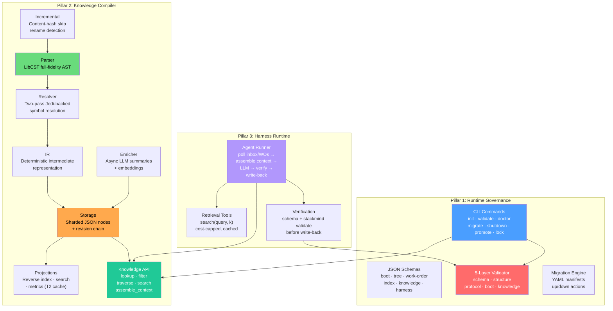
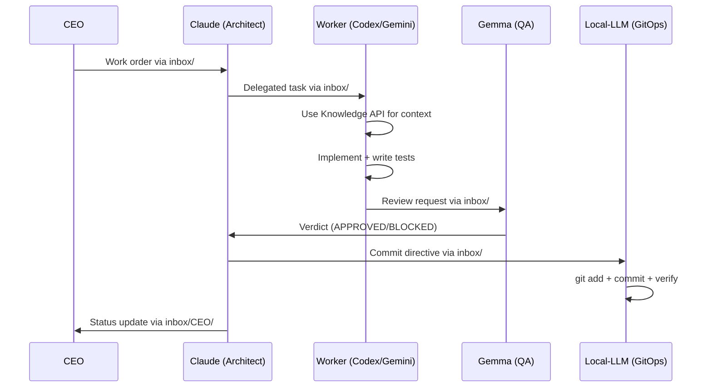
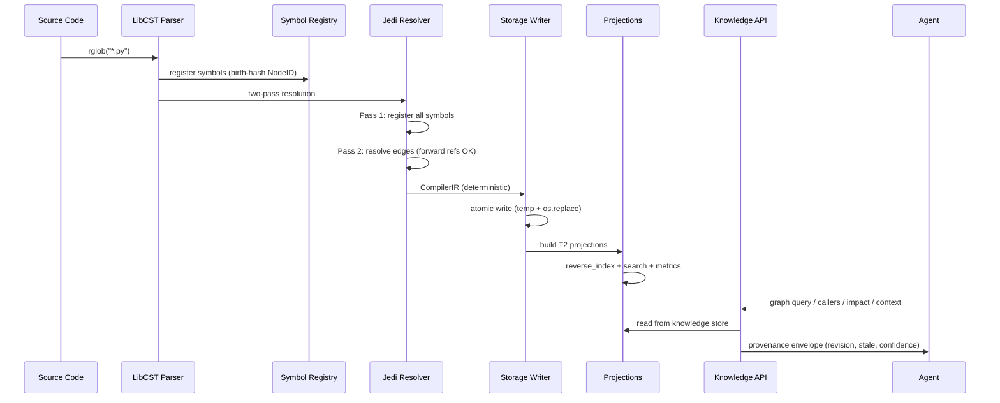

# STACKMIND
> Compiler-Backed Multi-Agent Engineering Runtime

**Version:** 2.0.0 · **Python:** ≥3.10 · **License:** MIT · **Author:** Abhishek Sharma

---

## Table of Contents
1. [What Is StackMind?](#1-what-is-stackmind)
2. [Quick Start](#2-quick-start)
3. [Architecture](#3-architecture)
4. [Knowledge Compiler](#4-knowledge-compiler)
5. [Knowledge API](#5-knowledge-api)
6. [Harness Runtime](#6-harness-runtime)
7. [CLI Reference](#7-cli-reference)
8. [Protocols](#8-protocols)
9. [Migration Guide](#9-migration-guide)
10. [Multi-Agent Workflow Demo](#10-multi-agent-workflow-demo)
11. [Validation Layers](#11-validation-layers)
12. [File Structure](#12-file-structure)
13. [Tech Stack](#13-tech-stack)
14. [Key Design Decisions](#14-key-design-decisions)
15. [Team Evolution](#15-team-evolution)
16. [Incident History](#16-incident-history)
17. [References](#17-references)

---

## 1. What Is StackMind?

StackMind compiles your Python source into a persistent, queryable knowledge graph. Ask "who calls this function?", "what breaks if I rename it?", or "give me context for this task" — and get instant answers without scanning files.

StackMind is also a runtime platform that coordinates teams of AI agents working on a shared software project. Every time an AI agent (or a developer) opens a project, they typically rebuild their understanding from scratch — reading files, grepping, guessing. StackMind compiles that understanding once and makes it queryable forever. It provides three integrated pillars: **governance** (protocol enforcement), a **knowledge compiler** (deterministic source understanding), and a **harness** (governed agent execution). Together, they form an operating system for multi-agent engineering where agents start from shared compiled understanding instead of independently rediscovering context.

### The Three Pillars

| Pillar | What It Does | Status |
|--------|-------------|--------|
| **1. Runtime Governance** | Messaging, task management, session continuity, protocol enforcement, write locks | Shipped v1.2.0 |
| **2. Knowledge Compiler** | Deterministic source→IR compilation, persistent knowledge store, query API | Shipped v2.0.0 |
| **3. Harness Runtime** | Governed agent execution loop with Knowledge API integration | Shipped v2.0.0 |

### Core Capabilities

| Capability | What It Does |
|---|---|
| **Inbox/Outbox Messaging** | Structured agent-to-agent communication with `_read/` deduplication |
| **Work Order Management** | Task lifecycle (ACTIVE → BLOCKED → COMPLETED) with deliverable tracking |
| **Boot Snapshots** | Session continuity across context-window limits — agents resume where they left off |
| **Schema Validation** | 5-layer runtime integrity checks (schema, structure, protocol, boot, knowledge) |
| **Knowledge Compiler** | Deterministic source-to-IR: parse, resolve, store, project — byte-identical output |
| **Symbol Registry** | Permanent identity (NodeID) that survives renames, moves, and refactoring |
| **Knowledge API** | Four query primitives: lookup, filter, traverse, search + context assembly |
| **Incremental Compilation** | Content-hash dirty detection, affected-set computation, rename/move detection |
| **Background Intelligence** | Async LLM enrichment (summaries, embeddings) without touching deterministic state |
| **Harness Runner** | Governed agent execution: poll → context → LLM → verify → write-back |
| **Write Lock** | Serializes canonical writes so agents don't clobber shared state |
| **Promotion Gate** | Validate-before-and-after gate for worker draft → canonical snapshot promotion |
| **Migration System** | YAML-manifest driven version upgrades with rollback support |

### Authority Model

```text
CEO (Top Manager)
  └─ Claude (Senior Architect)
       └─ Gemma (QA Lead)
            └─ Workers: Codex, Gemini, Local-LLM
```

Claude owns canonical state. Workers write drafts that get promoted through a validation gate. CEO oversees via inbox.

---

## 2. Quick Start

### Installation

```bash
pip install stackmind
```

Or install from source:
```bash
git clone https://github.com/stackmind/stackmind.git
cd stackmind
pip install -e .
```

### Requirements

- Python ≥ 3.10
- Dependencies: `click`, `libcst`, `jedi`, `pyyaml`, `jsonschema`, `rich`

### Basic Usage

Point it at any Python project — no init or config required:
```bash
# Compile entire project into knowledge store
stackmind graph build -p /path/to/your/project

# Query symbols without scanning files
stackmind graph query "my_function" -p /path/to/your/project

# Who calls this symbol?
stackmind graph callers "my_function" -p /path/to/your/project

# Impact analysis for a rename
stackmind graph impact "my_function" --depth 3 -p /path/to/your/project

# Assemble context for an LLM prompt
stackmind graph context "How does auth work?" --token-budget 2000 -p /path/to/your/project
```

### Multi-Agent Runtime Setup

StackMind also includes a full multi-agent coordination runtime for teams of AI agents. Initialize a governed project:
```bash
stackmind init ./my-project --name "My Project"

# Validate runtime health
stackmind validate ./my-project

# Check runtime status
stackmind doctor ./my-project

# Incremental update after changes
stackmind graph update -p ./my-project
```

### External Project Support

The Knowledge Compiler works on **any Python project** — no `stackmind init` required. For external projects:
- Lock acquisition is skipped (no governance runtime)
- Enrichment queue is skipped (no cost config)
- Only `.sync/knowledge/` is created (registry + nodes + projections)
- Common directories excluded: `venv/`, `.venv/`, `node_modules/`, `site-packages/`

---

## 3. Architecture

### Engine vs Instance

stackmind separates the reusable infrastructure from project-specific runtime state.

```text
┌─────────────────────────────────────────────────────────────┐
│                    stackmind PLATFORM                       │
├─────────────────────────────────────────────────────────────┤
│  Runtime Engine (this package)  │  Runtime Instance (per-project)  │
│  ────────────────────────────────────────────────────────────────  │
│  • CLI tooling                  │  • Live agent state               │
│  • Schema definitions           │  • Inbox/outbox history          │
│  • Template files               │  • Work order history            │
│  • Validation rules             │  • Decision log                  │
│  • Migration scripts            │  • Session reports               │
└─────────────────────────────────────────────────────────────┘
```

### Engine Structure vs Instance Structure

**Engine Structure (stackmind package)**
```text
stackmind/
├── cli/                    # CLI commands
├── schemas/               # JSON Schema definitions
├── templates/             # Runtime templates
├── validators/            # Validation logic
├── migrations/            # Version migrations
└── docs/                  # Documentation
```

**Instance Structure (generated by init)**
```text
my-project/
├── AGENTS.md              # Authoritative agent rules (project root)
└── .sync/                 # Runtime instance (separate git repo)
    ├── RUNTIME_VERSION    # Version tracking
    ├── runtime/           # Runtime state
    ├── work-orders/       # Task management
    ├── agents/            # Agent contracts
    ├── inbox/             # Agent messages (per-agent subdirs)
    ├── outbox/            # Session reports
    └── decisions/         # Decision log
```

### Three-Pillar Architecture Diagram



### Data Flow (Agent Coordination)



### Two Repositories Concept & `.sync-ref` Anchoring

Every project has two git repositories:
1. **Project repo** (`my-project/.git`) — Code, docs, configuration
2. **Sync repo** (`my-project/.sync/.git`) — Runtime state, messages, decisions

This ensures runtime history is independent of code history. Because `.sync/` is git-ignored, a `.sync-ref` file tracks the last-known-good `.sync` commit SHA in the **main** repo. `stackmind validate` checks this to prevent uncommitted or out-of-order mutations.

### Authority Model & Role Ownership

In production deployments, the agent names represent logical execution roles, not hardcoded AI model instances. 

| Role | Operational Scope & Ownership | Accountability & Ethics Guardrails |
|------|-------------------------------|------------------------------------|
| **CEO** | Product scope, priorities, release scheduling, and policy overrides. | Ultimate approval authority. Represents human oversight/custodian gate. |
| **Claude** | Architecture, planning, work order creation, and runtime state promotions. | Must document and log all structural normalization actions as decisions. |
| **Gemma** | Quality gates, test verification, reviews, and work order approvals. | Enforces strict validation layers; blocks non-compliant or unvetted work. |
| **Codex** | Backend code implementation and unit testing. | Restricted to local implementation; cannot modify canonical state directly. |
| **Gemini** | Frontend code implementation and UI testing. | Restricted to local implementation; cannot modify canonical state directly. |
| **Local-LLM** | GitOps, CI/CD pipelines, repository sync, and release artifacts. | Accountable for maintaining consistent commit tracking and sync reference links. |

### Ethical Safeguards
1. **Human Supremacy & Custody**: Human operators maintain ultimate custody.
2. **Audit Trails & Decision Transparency**: All canonical file modifications are strictly recorded in the `decisions/` folder.
3. **Double-Gated Work Flow**: Every completion requires QA review and architectural check.

### Key Invariants
1. All runtime state lives under `.sync/`
2. `project-root/AGENTS.md` is authoritative
3. stackmind never assumes any specific project
4. Templates contain zero operational history
5. Only Claude writes to `TREE.yaml` and `runtime/boot/`
6. Workers write drafts to `runtime/drafts/`, never to `runtime/boot/`
7. Canonical writes are serialized by the `runtime/LOCK` write lock
8. Draft → canonical promotion is validation-gated and recorded as a decision
9. `TREE.yaml` work-order totals must agree with the `INDEX.yaml` ledger

---

## 4. Knowledge Compiler

The Knowledge Compiler deterministic compilation from source to IR. 

### Pipeline Stages



- **Ingestion**: Source read and LibCST parsing
- **Symbol Resolution**: Two-pass Jedi-backed inference
- **Semantic Analysis**: IR creation, deterministic properties
- **Projection**: Cache projections, reverse indexing
- **Background Intel**: Async LLM embeddings

### Symbol Registry
Symbols get a permanent identity (NodeID) using birth-hashes. `NodeID = TYPE-first16(SHA256(path:qualname))`. This survives renames, moves, and refactoring via alias detection.

### Knowledge Store Directory Structure (Three-Tier Storage Model)

```text
.sync/knowledge/
├── registry/           # T0 — Canonical symbol identity (sharded)
├── nodes/              # T1 — Deterministic node documents
├── revisions/          # T1 — Monotonic revision chain
└── cache/              # T2 — Derived (gitignored, rebuildable)
    ├── reverse_index/
    ├── search/
    ├── metrics/
    └── embeddings/
```

- **T0**: Canonical identity. Never derived, never deleted.
- **T1**: Compiled truth. Deterministic output of compiler.
- **T2**: Derived cache. Can be deleted and rebuilt anytime.

### Resolution Tiers
| Tier | Meaning | Example |
|------|---------|---------|
| **RESOLVED** | Target is a known NodeID within the project | `my_module.helper()` |
| **EXTERNAL** | Target is stdlib or third-party | `os.path.join()` |
| **UNRESOLVED** | Target cannot be resolved (recorded, never dropped) | dynamic call |

### Incremental Compilation
Change one file, only affected symbols recompile using content-hash dirty detection, skipping unnecessary computation.

### Background Intelligence
Async LLM enrichment (summaries, embeddings) running without modifying the deterministic compiled state.

---

## 5. Knowledge API

The API allows query access to the compiled knowledge graph without file scanning.

- **Four Query Primitives**: 
  1. `lookup` - Fetch nodes by ID or exact match
  2. `filter` - Filter nodes by kind, path, etc.
  3. `traverse` - Walk relationships (callers/callees/impact)
  4. `semantic` - Search using vector embeddings
- **Context Assembly**: `assemble_context` function gathers bounded, ranked bundles for LLM prompts while respecting a token budget.
- **Response Contract**: Returns a provenance envelope (revision, git_commit, stale flag, confidence). Explicit truncation reporting.
- **Freshness**: Stale results are served but explicitly flagged as stale if the graph is out of date. 

---

## 6. Harness Runtime

The Harness Runtime provides governed agent execution.

- **Execution Loop**: poll inbox/WOs → assemble context via Knowledge API → send to LLM → verify output against schema → write-back on success.
- **Retrieval Tools**: Search and context retrieval tools with bounded token constraints and cost-capping.
- **Verification Gate**: Invalid output never persists silently. All writes go through `stackmind validate`.
- **Safety Mechanisms**: Checked locking, infinite-loop abort, retrieval caps, prompt-injection defense. Harness execution runs at the Worker level and cannot change canonical state directly.

---

## 7. CLI Reference

### Commands Overview

| Command | Description |
|---------|-------------|
| `stackmind init` | Initialize a new runtime |
| `stackmind validate` | Validate runtime health |
| `stackmind doctor` | Check runtime status |
| `stackmind migrate` | Migrate runtime version |
| `stackmind shutdown` | Shutdown an agent session with handoff validation |
| `stackmind promote` | Promote a worker draft snapshot to canonical (gated) |
| `stackmind lock` | Manage the runtime write lock (`acquire`/`release`/`status`) |
| `stackmind graph` | Subcommands: `build`, `update`, `watch`, `query`, `callers`, `impact`, `explain`, `context`, `stats`, `versions` |
| `stackmind harness` | Subcommands: `run-once` |

### Detailed Commands

**`stackmind init <project_path> [OPTIONS]`**
- Options: `--name`, `--agents`, `--no-git`
- Creates the `.sync/` runtime tree, schemas, and `AGENTS.md`.

**`stackmind validate [project_path] [OPTIONS]`**
- Validates 5 layers: Schema, Structure, Protocol, Boot Integrity, Knowledge.
- Runtime Integrity Checks include canonical drift, snapshot version lag, lock integrity, unread message loops, and `.sync-ref` anchoring.
- Use `--fix` to auto-fix minor issues.

**`stackmind doctor [project_path]`**
- Checks version, schema compatibility, agent active/idle status, compliance status, and pending migrations.

**`stackmind migrate [project_path] [OPTIONS]`**
- Options: `--to VERSION`, `--check`, `--rollback`
- Applies YAML-manifest driven version upgrades with auto-rollback on failure.

**`stackmind shutdown <agent> [OPTIONS]`**
- Options: `--project`, `--force`, `--defer`
- Gates enforced: Handoff report must exist, inbox drain (no unread files). Snapshots are synced to `tree_version` to prevent version lag.

**`stackmind promote <agent> [OPTIONS]`**
- Promotes a draft snapshot to canonical boot file. Gated by validation before and after. Writes a `NORMALIZATION` decision in the audit log.

**`stackmind lock <acquire|release|status>`**
- Manages the advisory `.sync/runtime/LOCK` write lock to serialize canonical writes. 
- `--force` steals a lock and logs a `LOCK_STOLEN` event.

**`stackmind graph`**
- `build -p path` - Full compile and project
- `update -p path` - Incremental from git diff
- `watch -p path` - File watcher daemon
- `query`, `callers`, `impact`, `explain`, `context`, `stats`, `versions`

**Environment Variables**
- `stackmind_DEBUG`, `stackmind_QUIET`, `stackmind_NO_COLOR`

---

## 8. Protocols

### Protocol Summary

| Protocol | Title | Purpose |
|----------|-------|---------|
| **D021** | Agent Boot/Resume Optimization | Snapshot-based resume system |
| **D022** | Work Orders Architecture | Persistent task management |
| **D023.x** | Protocol Enforcement Patches | Compliance, receipts, graph awareness |
| **D024** | Mandatory Review Handoff | Quality gate enforcement |
| **D025** | Destructive Operations Safeguard | Backup-verify-approve before irreversible ops |
| **D031** | Runtime Compatibility & Migration | Version management |

### Boot Sequence (D021+)
1. Read `AGENTS.md`
2. Read `runtime/boot/<self>.boot.yaml`
3. Peek `TREE.yaml` for `tree_version` (skip full read if matches)
4. Check `PROTOCOL_DIGEST.hash`
5. Check `graph_version` (skip graph context read if matches)
6. Check inbox counts and unread WOs
7. Resume from `next_action`

### Shutdown Sequence
1. Write draft snapshot
2. Write session report
3. Write shutdown receipt
4. Archive inbox to `_read/`
5. Output Handoff Report block
6. Commit `.sync/` repo

### Work Orders
- **Ownership**: Claude creates, assigns, updates, and completes. Workers only read. Workers **never** self-assign.
- **Completion Rules**: Worker writes code, requests review from Gemma, and sends completion notice to Claude.

### Compliance & Enforcement (D023.2)
- Agents lacking shutdown receipts or ignoring directives are marked `NON_COMPLIANT` and escalate to CEO.

### Inbox SLA Rules
- Directives acknowledged in same session. Processed moved to `_read/`.

### Runtime Integrity Enforcement
- **Write Lock**: Serializes canonical writes.
- **Inbox Drain**: `stackmind shutdown` refuses to close if unread items remain. 
- **Promotion Gate**: Validates draft before promoting to canonical.
- **Audit Trail**: Generates `NORMALIZATION` decision for tracing.

### Version Management (D031)
- Follows Semantic Versioning. Major = breaking schemas, Minor = backward-compatible schema changes, Patch = backward-compatible fixes.

### Destructive Operations Safeguard (D025)
Any command rewriting history, deleting files en masse, or irreversible must follow: BACKUP → VERIFY → ESCALATE (to CEO) → EXECUTE → VALIDATE → ROLLBACK (if validation fails). E.g., `git filter-repo`, `git reset --hard`, `rm -rf`.

### Forbidden Actions
- Modifying another agent's files
- Changing architecture without Claude approval
- Destructive ops without D025 compliance
- Bypassing lock or verification gates
- Workers modifying `TREE.yaml`

---

## 9. Migration Guide

StackMind migrations use YAML manifests and support both automatic and manual steps.

- **Checking for Updates**: `stackmind migrate --check`
- **Running Migrations**: `stackmind migrate` (automatically backs up to `.backup/`)
- **Version File**: Tracked in `.sync/RUNTIME_VERSION`
- **Breaking Changes**: Fully documented matrix. CLI v1 is incompatible with Runtime v2. CLI v2 is read-only for Runtime v1.
- **Rollback**: Automatic on failure, or manual via `stackmind migrate --rollback`
- **Examples**: Handles field mapping, schema changes, and normalization of drifted enum data losslessly (preserving original text).

---

## 10. Multi-Agent Workflow Demo

### Workflow Steps
1. **CEO Writes Request**: Adds file to `inbox/claude/` for a new feature.
2. **Claude Boots**: Reads request, acquires lock, creates formal Work Order in `ACTIVE/`, updates `INDEX.yaml` and `TREE.yaml`, sends assignment to Codex, outputs handoff, and shuts down.
3. **Codex Boots**: Uses Knowledge API for context, implements feature, writes tests, sends review request to Gemma, and sends completion notice to Claude. Shuts down.
4. **Gemma Boots**: Runs linter, tests, and validation. Sends APPROVED verdict to Claude. Shuts down.
5. **Claude Boots**: Reads approval, sends commit directive to Local-LLM. Shuts down.
6. **Local-LLM Boots**: Commits project code and `.sync/` state. Sends commit SHA to Claude. Shuts down.
7. **Claude Boots**: Acquires lock, moves WO to `COMPLETED/`, updates indices, sends status report to CEO. Shuts down.

### Flow Diagram
```text
CEO ─→ Claude (creates WO) ─→ Codex (implements) ─→ Gemma (QA) ─→ Claude (routes) ─→ Local-LLM (commits) ─→ Claude (closes) ─→ CEO
```

---

## 11. Validation Layers

| Layer | Checks |
|---|---|
| **1. Schema** | YAML syntax, JSON Schema compliance for boot, tree, work-orders, index |
| **2. Structure** | Required directories exist, required files present |
| **3. Protocol** | Authority model, blocked-agent rules, deliverable requirements, write-lock integrity, GEMINI-02 citations |
| **4. Boot Integrity** | Snapshot consistency, version alignment, canonical drift (TREE vs INDEX), `.sync-ref` anchoring |
| **5. Knowledge** | No duplicate NodeIDs, edge targets exist or flagged, revision chain unbroken, canonical form |

---

## 12. File Structure

```mermaid
graph TD
    ROOT["📁 stackmind/"] --> CLI_DIR["📁 cli/<br/><i>CLI commands</i>"]
    ROOT --> SCHEMAS_DIR["📁 schemas/<br/><i>JSON Schema definitions</i>"]
    ROOT --> VALIDATORS_DIR["📁 validators/<br/><i>Validation + Knowledge + Harness</i>"]
    ROOT --> MIGRATIONS_DIR["📁 migrations/<br/><i>Version upgrade manifests</i>"]
    ROOT --> TEMPLATES_DIR["📁 templates/<br/><i>Project scaffolding</i>"]
    ROOT --> TESTS_DIR["📁 tests/<br/><i>pytest suite (304 tests)</i>"]
    ROOT --> DOCS_DIR["📁 docs/<br/><i>Architecture + RFCs</i>"]

    CLI_DIR --> CLI_MAIN["main.py — Click entrypoint"]
    CLI_DIR --> CLI_GRAPH["graph.py — Knowledge graph commands"]
    CLI_DIR --> CLI_HARNESS["harness.py — Agent runner"]
    CLI_DIR --> CLI_VAL["validate.py — 5-layer validator"]
    CLI_DIR --> CLI_LOCK["lock.py — Write lock mgmt"]
    CLI_DIR --> CLI_OTHER["init · migrate · shutdown · promote · doctor · decisions"]

    VALIDATORS_DIR --> VK["📁 knowledge/<br/><i>Knowledge Compiler</i>"]
    VALIDATORS_DIR --> VH["📁 harness/<br/><i>Agent Runner</i>"]

    VK --> VK_REG["registry.py — Symbol Registry"]
    VK --> VK_COMP["📁 compiler/<br/>parse · resolve · ir<br/>incremental · rename · watcher"]
    VK --> VK_STORE["storage.py + writer.py"]
    VK --> VK_PROJ["📁 projections/<br/>reverse_index · search · metrics"]
    VK --> VK_API["api.py — Knowledge API"]
    VK --> VK_ENRICH["enricher.py + enricher_queue.py"]
    VK --> VK_VAL["validate.py — Layer-5"]

    VH --> VH_RUN["runner.py — Governed execution loop"]
    VH --> VH_RET["retrieval.py — Search tools"]

    SCHEMAS_DIR --> S_RT["boot · tree · work-order · index"]
    SCHEMAS_DIR --> S_K["📁 knowledge/<br/>symbol · node · revision · ai-block"]
    SCHEMAS_DIR --> S_H["harness-output.schema.json"]

    style ROOT fill:#4a9eff,color:#fff
    style CLI_DIR fill:#69db7c,color:#000
    style VALIDATORS_DIR fill:#ff6b6b,color:#fff
    style VK fill:#20c997,color:#fff
    style VH fill:#b197fc,color:#fff
    style SCHEMAS_DIR fill:#ffa94d,color:#000
```



---

## 13. Tech Stack

| Component | Technology |
|---|---|
| Language | Python ≥3.10 |
| CLI Framework | Click ≥8.0 |
| Parser | LibCST (full-fidelity AST) |
| Resolver | Jedi (cross-file inference) |
| Schema Validation | jsonschema ≥4.0 |
| Data Format | YAML (PyYAML ≥6.0) + JSON (knowledge store) |
| Terminal Output | Rich ≥13.0 |
| Build System | Hatchling |
| Testing | pytest + pytest-cov |
| Linting | Ruff |

---

## 14. Key Design Decisions

1. **File-system as database** — All state lives in YAML/JSON files under `.sync/`. No external DB. Git tracks history.
2. **Deterministic compilation** — Same source + same registry → byte-identical IR. No RNG, no wall-clock, no absolute paths.
3. **Birth-hash identity** — `NodeID = TYPE-first16(SHA256(path:qualname))`. Assigned once, frozen forever. Survives renames via alias.
4. **Three-tier storage** — T0 (canonical identity), T1 (compiled truth), T2 (derived cache). T2 is always rebuildable.
5. **Atomic writes** — temp-file + `os.replace()`. Crash never leaves half-written state.
6. **Write lock** — Single LOCK file serializes canonical writes across concurrent agent sessions.
7. **Promotion gate** — Workers can't directly modify canonical boot snapshots. Draft → validate → promote → validate.
8. **External project support** — Knowledge Compiler works without governance runtime. Lock skipped, only knowledge store created.
9. **Anti-orchestration discipline** — Harness required proving Knowledge API value before being built (gate condition).
10. **Resolution tiers** — Unresolved calls are RECORDED, never dropped. Complete graph even with partial resolution.

---

## 15. Team Evolution

**Per-Agent Learnings:**
- **Claude**: Learned snapshot-based boots reduce context waste. Shifted to minimal actionable work orders.
- **Gemini**: Component isolation enables parallel work. Incremental delivery reduces QA turnaround.
- **Codex**: API contracts must be locked before frontend work. Stateless design simplifies coordination.
- **Gemma**: Checklists catch more issues. Blocking early saves time.
- **Local-LLM**: Atomic commits with clear messages enable bisect debugging.

**Team-Wide Learnings:**
1. Protocol > Improvisation (defined handoffs eliminated ambiguity).
2. Async-first works perfectly with explicit state.
3. Trust but verify (Workers propose, architects commit, QA gates).
4. Explicit shutdown handoffs prevent lost work.

---

## 16. Incident History

- **2026-05-20**: Source code loss incident resulting from `git filter-repo` wiping all repository history.
- **Outcome**: Led to the creation of **D025 (Destructive Operations Safeguard)**, requiring backup, CEO approval, and strict execution validation.

---

## 17. References

- Documentation & RFCs: `docs/` folder
- Protocol Rules: `AGENTS.md`
- Implementation Plans: `PLANv1.md` and `PLANv2.md`
- Releases: `RELEASE-v2.0.0.md`
